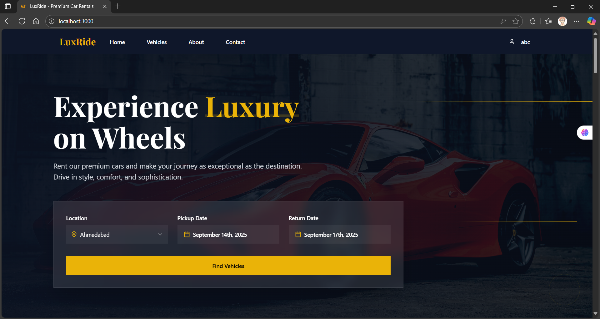
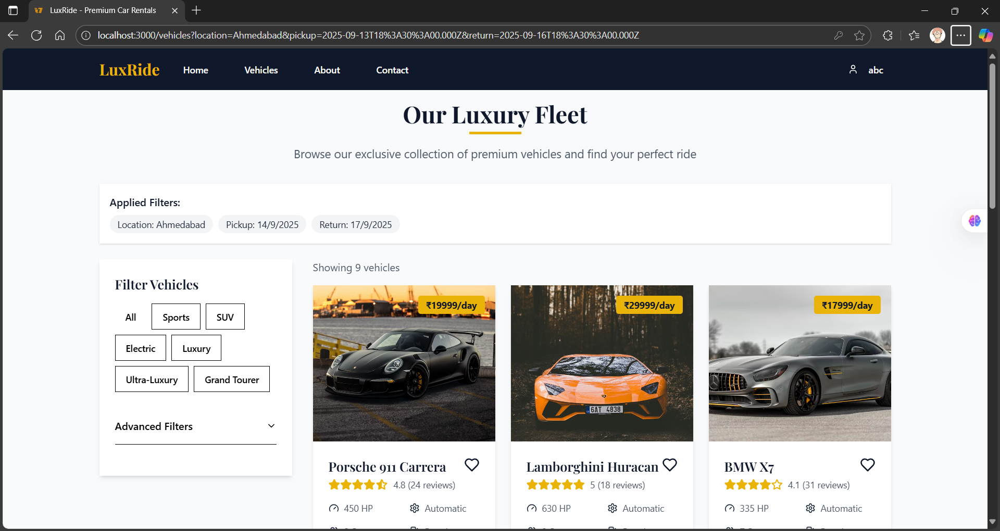
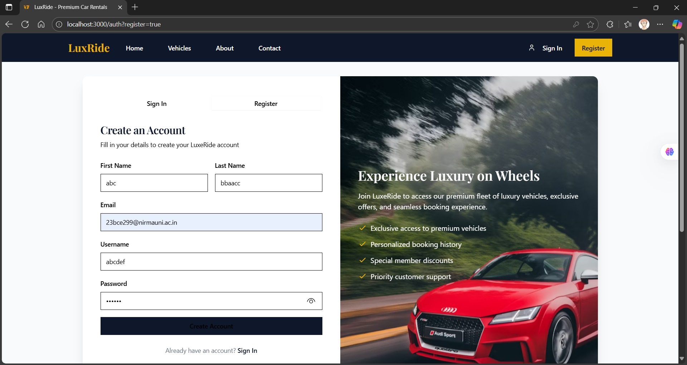
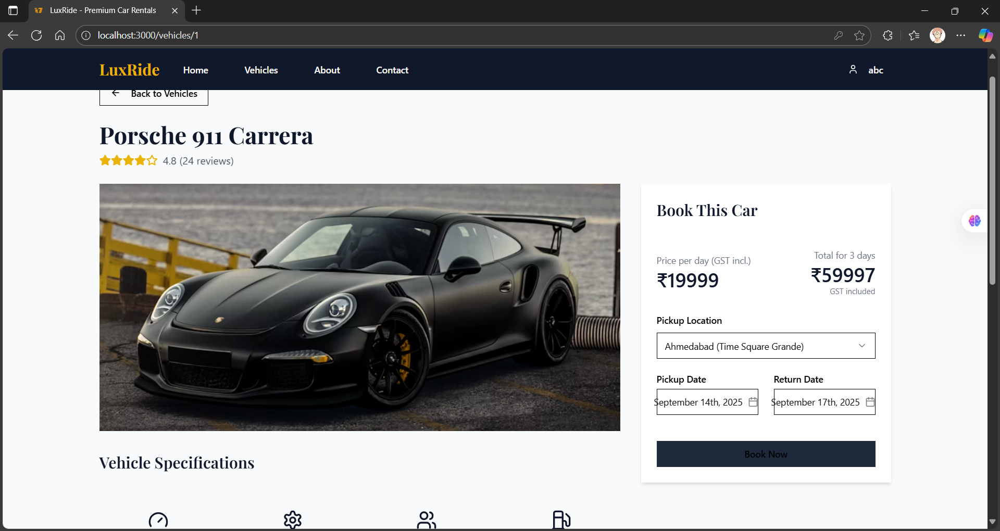
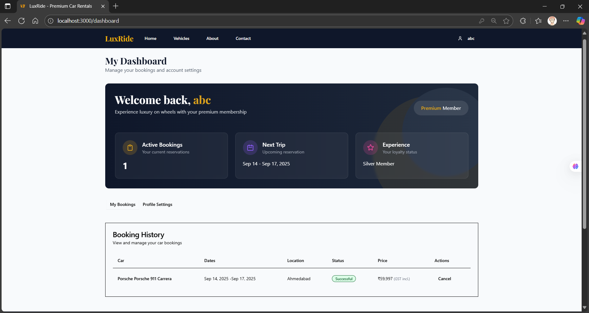
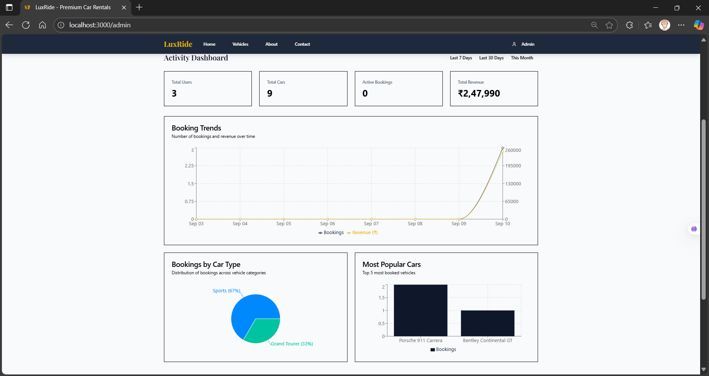
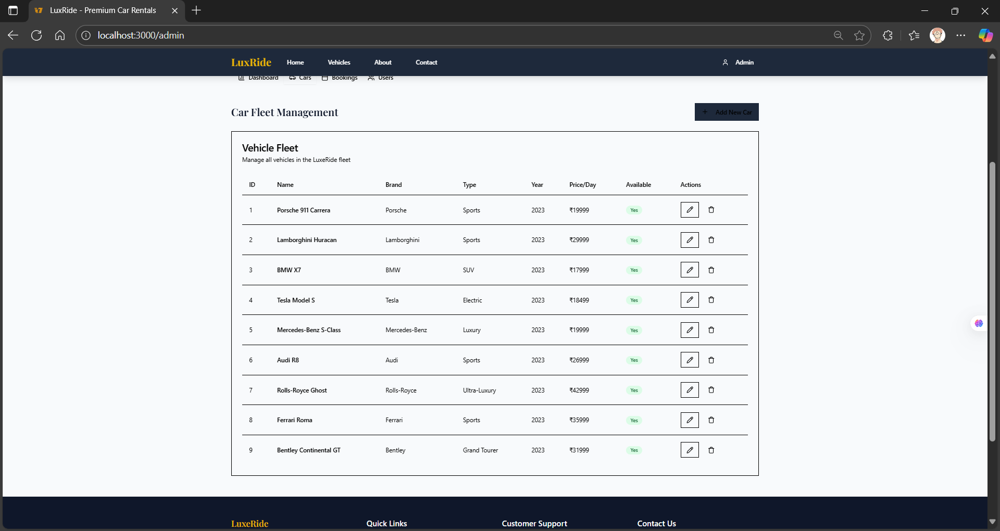
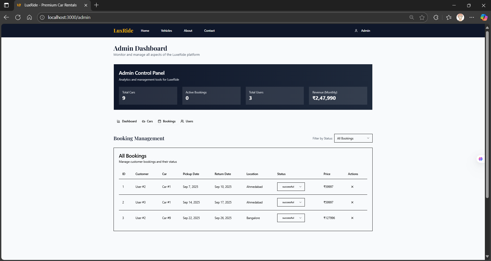
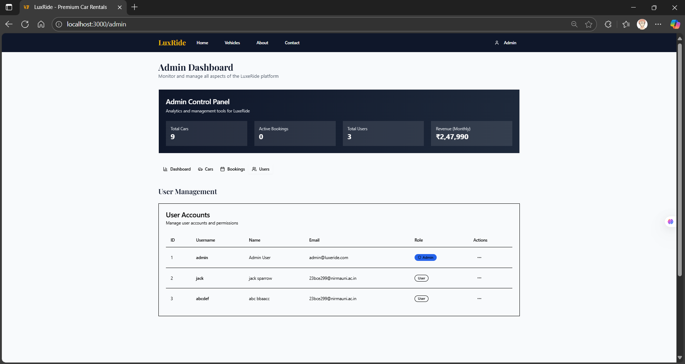

# 🚗 LuxRide – Premium Car Rental Platform

LuxRide is a full-stack car rental web application that replicates the experience of a real-world premium vehicle booking system.  
The goal of this project was to build a complete, practical product with a smooth booking flow, clean UI, and proper dashboard-based management.

This project was developed as an end-to-end learning implementation, covering frontend development, backend APIs, database design, and real usage scenarios.

---

## ✨ Key Highlights

- Realistic car booking workflow
- Separate dashboards for users and admins
- Clean and responsive UI
- Backend-driven data handling
- Practical database usage with relations

---

## 👤 User Features

- Browse premium cars by category
- View detailed vehicle information
- Select rental dates and pickup location
- Book vehicles with payment simulation
- Track bookings from a personal dashboard
- View booking history and status

---

## 🛠️ Admin Features

- Dedicated admin dashboard
- View overall booking and revenue statistics
- Manage vehicle listings
- Analyze popular cars and booking trends
- Monitor user activity and bookings
- Visual insights using charts and summaries

---

## 🖼️ Screenshots

> Screenshots captured from the running application.

### Homepage


### Vehicle Listings


### Login Page


### Vehicle Details & Booking



### User Dashboard


### Admin Dashboard





---

## 🧰 Tech Stack

### Frontend
- TypeScript
- Vite
- Tailwind CSS

### Backend
- Node.js
- Express.js

### Database
- PostgreSQL
- Drizzle ORM

### Development Tools
- Git & GitHub
- npm
- Replit (development & deployment)

---

## 📁 Project Structure (High Level)

LuxRide/
├── client/ # Frontend application
├── server/ # Backend APIs
├── shared/ # Shared utilities & types
├── carsimg/ # Vehicle images & static assets
├── screenshots/ # Project screenshots
├── README.md


---

## 🚀 Running the Project Locally

### Prerequisites
- Node.js (v18 or above)
- npm
- PostgreSQL database

### Setup & Run

```bash
npm install
npm run dev


The application runs on:

http://localhost:5000 

```

### 📌 Purpose of the Project

- LuxRide was built to:

- Understand real-world full-stack workflows

- Practice backend-frontend integration

- Implement authentication, bookings, and dashboards

- Work with relational databases using an ORM

- Design a scalable and clean project structure

### 📄 License

- This project is created for educational and learning purposes.